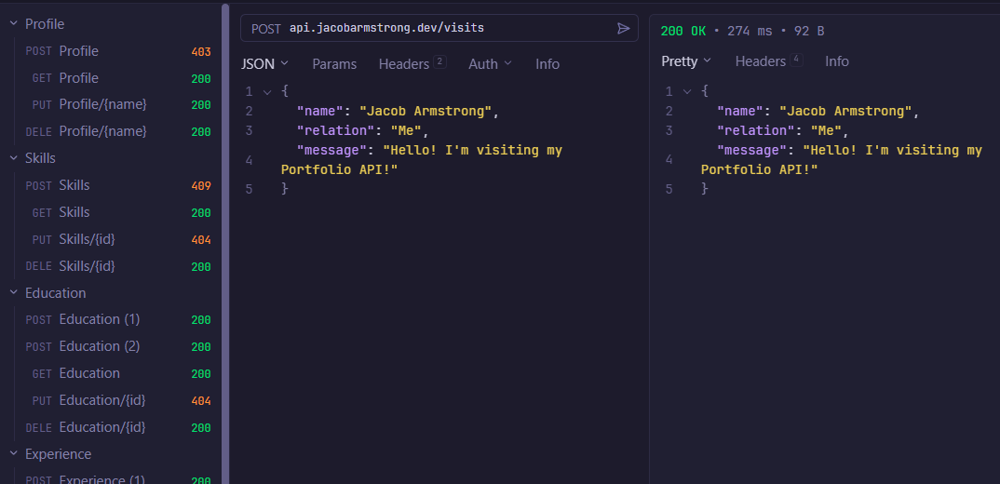

# Portfolio API
Welcome to my Portfolio API! This is an API to allow you to get basic information about me, and leave a visit on my website!



# Project overview
```app/main.py```<br>
The root file for the API, created using [FastAPI](https://fastapi.tiangolo.com/)

```app/database.py```<br>
Connection setup to the [PostgreSQL](https://www.postgresql.org/) database, hosted on [Neon](http://neon.tech)

```app/models.py```<br>
Models for the database tables, created using [SQLAlchemy](https://www.sqlalchemy.org/)

```app/schema.py```<br>
The data validation models for each endpoint method, using [Pydantic](https://docs.pydantic.dev/latest/)

```app/routers/```<br>
All of the endpoints for the API. Each file contains four methods -- POST, GET, PUT and DELETE

# Access the API Documentation
You can view the built-in API documentation with your choice of UI:
* Swagger UI: https://api.jacobarmstrong.dev/docs
* ReDoc: https://api.jacobarmstrong.dev/redoc
